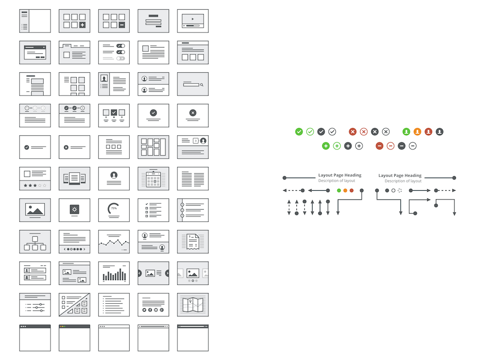

# Lesson 06 - UX Deliverables

> Interaction design is the process of identifying the path a user ought to take, and the most simple, useful actions that will send him or her along that path.

source: [UX Booth][2]

### Topics covered

* User stories
* User flows
* Mood boards and Styleguides
* InVision

**User Stories**

> “As a `<type of user>`, I want `<some goal>` so that `<some reason>`.”

source: [Mountain Goat Software][3]

* As a power user, I can specify files or folders to backup based on file size, date created and date modified.

* As a user, I can indicate folders not to backup so that my backup drive isn't filled up with things I don't need saved.

**User Flows**

Reusable user-flow components:

User-flow example:

**Mood Boards & Styleguides**

- - -

### Resources

* [InVision][1]
* [UX Booth][2]
* [Advantages of the “As a user, I want” user story template.][3]
* [Tactile Design Kit][4]

[1]:  https://www.invisionapp.com/
[2]:  http://www.uxbooth.com/
[3]:  https://www.mountaingoatsoftware.com/blog/advantages-of-the-as-a-user-i-want-user-story-template
[4]:  http://tactiledesignkit.com/

- - -

### Project: [UX Deconstruction](../../projects/03-ux-deconstruction/project-03.md)

